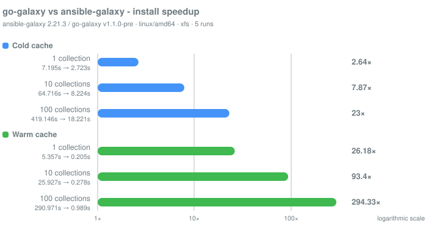

# Benchmarks

`go-galaxy` vs `ansible-galaxy` on three requirements files (1 / 10 / 100 root
collections, all without transitive deps for an apples-to-apples fetch+extract
comparison), measured on Linux with an xfs filesystem, which is what CI
overwhelmingly runs on.

Mean of 5 measured runs. The warm and frozen scenarios are preceded by one
priming run that is not measured. Both tools are invoked with `--no-deps`.



The chart is a separate, later measurement than the tables below: same host and
same `ansible-galaxy`, but `go-galaxy` at commit `58c23c3` and whatever the
Galaxy servers were publishing on the day. It is rendered by
[go-galaxy-benchmark](#go-galaxy-benchmark) from its own JSON report. Numbers
drift between the two runs - 18.4x against 21.1x on the cold 100-collection
row - because the collection versions do.

## Local cache

| Scenario             | 1 collection | 10 collections | 100 collections |
|:---------------------|-------------:|---------------:|----------------:|
| **cold cache**       |              |                |                 |
| ・ansible-galaxy      |       8.99 s |       152.28 s |        458.10 s |
| ・go-galaxy           |       2.93 s |         7.71 s |         21.67 s |
| ・**speedup**         |     **3.1x** |      **19.8x** |       **21.1x** |
| **warm cache**       |              |                |                 |
| ・ansible-galaxy      |       5.43 s |        36.67 s |        343.00 s |
| ・go-galaxy           |      0.206 s |        0.292 s |          1.04 s |
| ・**speedup**         |    **26.4x** |     **125.6x** |      **330.1x** |
| **frozen + offline** |              |                |                 |
| ・go-galaxy           |      0.217 s |        0.309 s |          1.13 s |

**Read the warm row knowing what each tool caches.** `ansible-galaxy` keeps
only an API response cache - a single `api.json` - and downloads every tarball
into a temporary directory it deletes afterwards. Its warm run therefore still
re-downloads all 100 collections, and saves only the metadata round trips.
`go-galaxy` caches the tarballs and the extracted trees, and hardlinks the
installed files out of that cache. The three-hundred-fold figure is the honest
measurement of two different designs, not of the same design done faster.

The cold rows are network-bound and correspondingly noisy: `ansible-galaxy` at
10 collections spread from 87 s to 229 s across five runs. The `go-galaxy` warm
and frozen rows are the tight ones, within a few percent of their mean, because
they touch no origin at all.

## Filesystem sensitivity

A `--frozen --offline` install creates about 66,000 filesystem objects for the
100-collection set - 50,792 files and symlinks hardlinked out of the extracted
store, plus 15,762 directories. At 17.1 us per object on the volume measured
here, that is 1.13 s, which is essentially the entire figure.

So a warm or frozen number measures how fast the storage creates inodes, not
how fast anything is parsed or unpacked. Two consequences worth carrying to
your own hardware. These figures move with the filesystem and the device under
it, so they transfer between machines far less readily than a CPU-bound
benchmark would. And `--workers` is worth tuning only where inode creation
contends; on the volume measured here the derived default already performs
well.

## Roles

`testing/bench.sh` also measures a roles install, in two scenarios over
`testing/requirements-roles.yml` - ten widely used Galaxy roles with no
dependencies between them, so a `--no-deps` run measures fetch plus extract
over one flat set, as the collection files do:

- `roles-cold` - both tools' caches and the roles directory wiped before each
  run: `ansible-galaxy role install --no-deps -r requirements-roles.yml -p
  <dir>` against `go-galaxy install --no-deps -r requirements-roles.yml
  --roles-path <dir>`.
- `roles-warm` - go-galaxy's caches primed once, only the roles directory
  wiped between runs.

No figures are published here yet; the numbers come from running the script,
which writes `roles-cold.md` and `roles-warm.md` into `dist/bench/` and
appends them to `summary.md`:

```bash
SCENARIOS="roles-cold roles-warm" testing/bench.sh
```

Read a warm result knowing what each tool caches, as with the collection rows
above: `ansible-galaxy` keeps no cache for a role at all and downloads the
GitHub archive of the tag on every run, while `go-galaxy` caches the artifact
it built from the tag and the extracted tree, and hardlinks the installed
files out of that cache. The two tools also fetch differently on a cold run -
`ansible-galaxy` the tarball GitHub serves, `go-galaxy` a pack of the tagged
commit through the git protocol - so a cold figure compares two transports,
not one transport done faster.

## go-galaxy-benchmark

`cmd/go-galaxy-benchmark` is the same comparison as a Go binary, narrowed to
what it can measure without a second tool: collections only, `cold` and `warm`
only, no S3, no peak RSS and no disk figures. It needs neither `hyperfine` nor
a shell, resolves dependencies by default where `bench.sh` passes `--no-deps`,
and writes a JSON report holding every run's wall clock rather than a mean, so
a table or a chart can be redrawn from it without measuring again.

Two entry points. `run` measures and prints the table; `show` renders an
existing report as a table or as the SVG at the top of this page, and touches
neither the network nor the measured binaries. Every flag has a `GGB_`-prefixed
environment variable; the prefix is not `GO_GALAXY_` because this process sets
`GO_GALAXY_*` for the binary it is timing.

```console
# go-galaxy-benchmark run --ansible-galaxy /usr/bin/ansible-galaxy --go-galaxy /usr/bin/go-galaxy --work-dir /data/go-galaxy-vs-ansible-galaxy --requirements-dir ~/requirements/ --no-deps
✔ ansible-galaxy cold size 1: mean 8.058s over 5 runs
✔ go-galaxy cold size 1: mean 2.612s over 5 runs
✔ ansible-galaxy warm size 1: mean 5.377s over 5 runs
✔ go-galaxy warm size 1: mean 0.189s over 5 runs
✔ ansible-galaxy cold size 10: mean 43.198s over 5 runs
✔ go-galaxy cold size 10: mean 4.900s over 5 runs
✔ ansible-galaxy warm size 10: mean 29.070s over 5 runs
✔ go-galaxy warm size 10: mean 0.277s over 5 runs
✔ ansible-galaxy cold size 100: mean 465.601s over 5 runs
✔ go-galaxy cold size 100: mean 25.287s over 5 runs
✔ ansible-galaxy warm size 100: mean 267.363s over 5 runs
✔ go-galaxy warm size 100: mean 0.951s over 5 runs
✔ report written to /data/go-galaxy-vs-ansible-galaxy/report.json
ansible-galaxy  ansible-galaxy [core 2.21.3]
go-galaxy       v1.0.2-352-g58c23c3-dirty (commit 58c23c3, built by just @ 2026-08-22T07:19:13Z) // go1.27.0
host            linux/amd64, 4 cpus, xfs
measurement     5 runs, --no-deps

SCENARIO  SIZE  TOOL            MEAN      MIN       MAX       FAILED
cold      1     ansible-galaxy  8.058s    7.370s    9.077s    0
cold      1     go-galaxy       2.612s    2.460s    2.838s    0
cold      1     speedup         3.1x
cold      10    ansible-galaxy  43.198s   39.300s   45.891s   0
cold      10    go-galaxy       4.900s    3.366s    6.600s    0
cold      10    speedup         8.8x
cold      100   ansible-galaxy  465.601s  393.900s  658.204s  0
cold      100   go-galaxy       25.287s   22.761s   28.068s   0
cold      100   speedup         18.4x
warm      1     ansible-galaxy  5.377s    5.032s    5.970s    0
warm      1     go-galaxy       0.189s    0.186s    0.191s    0
warm      1     speedup         28.5x
warm      10    ansible-galaxy  29.070s   23.185s   36.152s   0
warm      10    go-galaxy       0.277s    0.259s    0.298s    0
warm      10    speedup         104.9x
warm      100   ansible-galaxy  267.363s  239.470s  299.250s  0
warm      100   go-galaxy       0.951s    0.900s    0.999s    0
warm      100   speedup         281.2x
```

The live line above each result carries the current run's elapsed time and the
total, so a cold 100-collection series is visibly working rather than hung. It
appears only where a spinner does, on a terminal: without one, every update
would be a new line in the log.

That `--no-deps` is what makes this run comparable with the tables above. Drop
it and the numbers change meaning rather than scale, because the two resolvers
then do different work.

The chart comes from the same report:

```bash
go-galaxy-benchmark show --report /data/go-galaxy-vs-ansible-galaxy/report.json \
  --format svg --out docs/benchmark.svg
```

Bars carry the ratio rather than the elapsed time, and the absolute pair sits
in the row's text. Seconds cannot share one axis here: 0.951 s beside 267 s
would be a bar narrower than a pixel. The ratios span the same three orders of
magnitude, so their axis is logarithmic as well, with a rule at every power of
ten the longest bar reaches. One scale serves both cache states, which is what
lets a warm bar be read against a cold one; a ratio at or below `1x` gets no
bar at all, only its figure.

## Reproduce

Two harnesses, and the one to reach for depends on what is missing from the
other. [go-galaxy-benchmark](#go-galaxy-benchmark) above needs nothing but the
two binaries and covers the collection rows. `testing/bench.sh` is what still
owns the S3 scenarios, the role scenarios, peak RSS and the disk figures.

`testing/bench.sh` is the full harness, including the S3 cache backend and a
peak-RSS pass; it needs `hyperfine`, a virtualenv with `ansible-core`, and
`docker compose -f testing/docker-compose.yaml up -d minio-svc` for the S3
scenarios. See [Development](development.md#the-benchmark-harness) for its
knobs and outputs.

```bash
python3 -m venv .venv && .venv/bin/pip install ansible-core
go build -o ./dist/go-galaxy ./cmd/go-galaxy
testing/bench.sh                   # all sizes, all scenarios
SIZES=10 testing/bench.sh          # one file
SCENARIOS="warm" testing/bench.sh  # one scenario
SCENARIOS="roles-cold roles-warm" testing/bench.sh  # the role scenarios only
```

Budget about three hours for a full default run against the public Galaxy; the
100-collection `ansible-galaxy` scenarios are most of it. Every cache the
script wipes lives under `$TMPDIR`, never in `$HOME` and never inside the
repository. Point `$TMPDIR` at real storage: a `tmpfs` measures RAM rather than
disk, which for a workload that is mostly inode creation describes nothing.

## Conditions

- **Tools:** `ansible-galaxy [core 2.21.3]` throughout. The tables come from
  `go-galaxy` at commit `826c765` built with go1.26.7; the chart at the top of
  the page from commit `58c23c3` built with go1.27.0.
- **Host:** a libvirt guest running Oracle Linux Server 10.1 on
  `6.12.0-203.76.7.5.el10uek.x86_64`, 4 vCPU and 8 GB of RAM. Storage is an
  SSD RAID6 array passed through from the hypervisor as a block device and
  formatted xfs. Both runs used the same guest.
- **Both tools** run with `--no-deps`, so what is measured is fetch plus
  extract rather than two different resolution algorithms. This is a choice
  about what the number means, not a workaround: `requirements-100.yml` does
  resolve, and `go-galaxy lock` builds a 102-collection lockfile from it in
  about four minutes against cold metadata.
- **Cold cache:** both tools' caches and the install directory wiped before
  every run. Each tool gets a cache of its own, and `ansible-galaxy` is given
  `ANSIBLE_COLLECTIONS_PATH` and `ANSIBLE_LOCAL_TEMP` inside the same working
  tree, so neither tool sees the other's state and both do their temporary work
  on the same filesystem.
- **Warm cache:** caches primed once, only the install directory wiped between
  runs.
- **Frozen + offline:** `go-galaxy lock` once, then `go-galaxy install --frozen
  --offline` - zero network calls.
